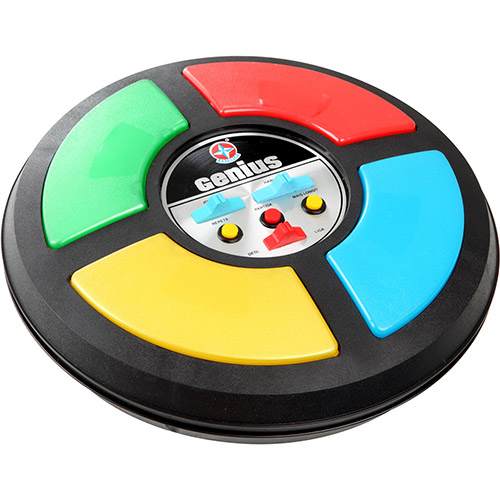
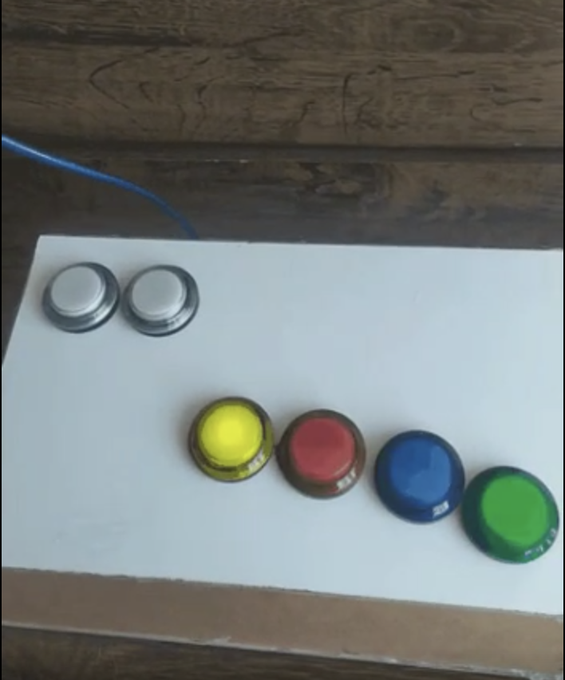
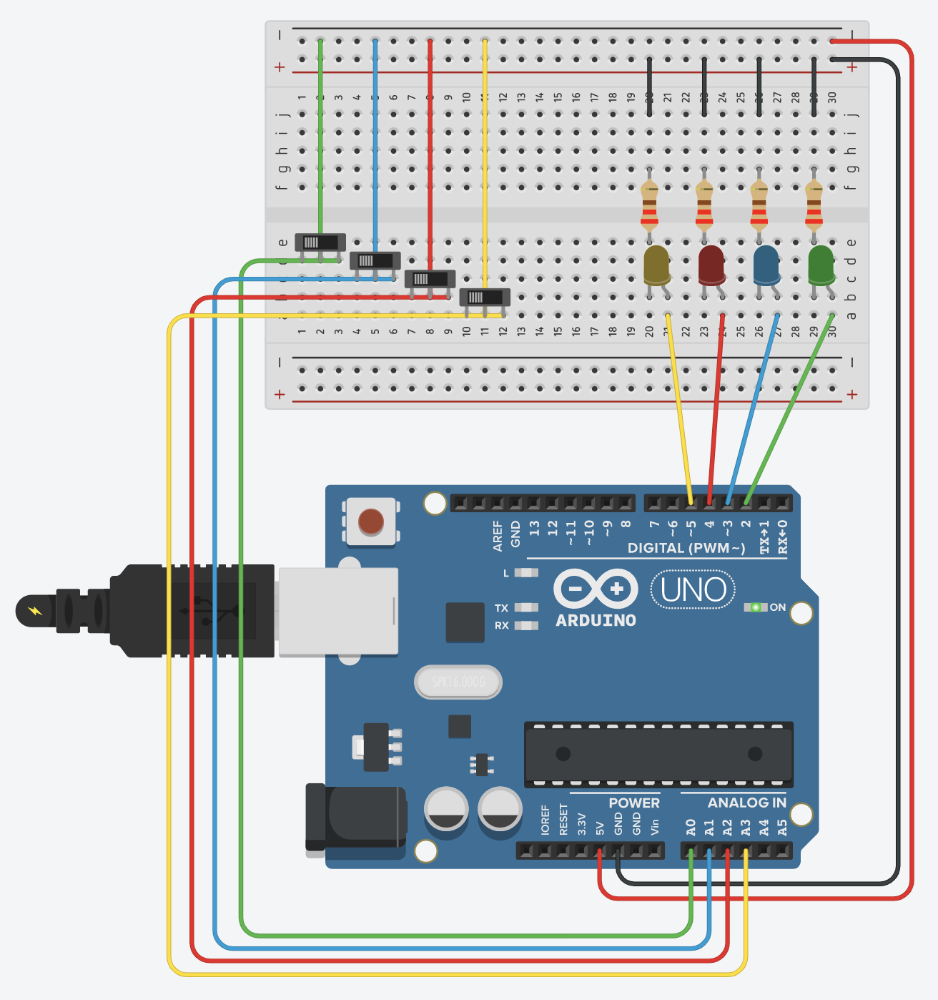

# jogo-memoria-arduino
Jogo de memória feito com Arduino Uno baseado no jogo Genius (Imagem abaixo).

Em tempo de pandemia (covid-19) resolvi criar um jogo de memória utilizando Arduino para entreter as crianças dentro de casa.

## Configurações do circuito

Para a montagem do circuito foi utilizando alguns componentes:

- 1 Arduino UNO R3
- 6 botoões de fliperama arcade com led
- 1 protoboard/placa de ensaio 400 furos
- 4 resistores 220 ohms
- 1,5 mts de fio para soldagem dos contatos

No projeto abaixo utilizei o interruptor deslizante para simular os botões analógicos de arcade, mas a lógica é a mesma.

